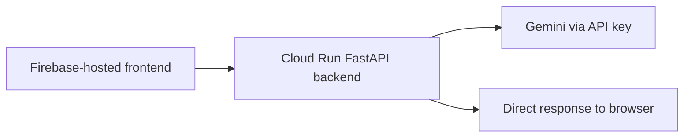
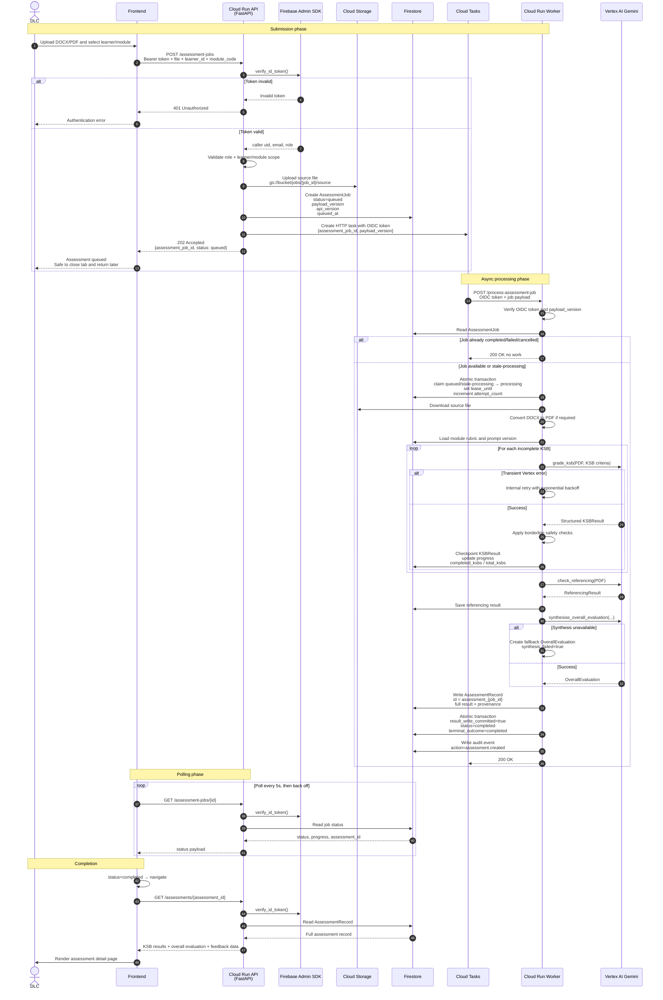
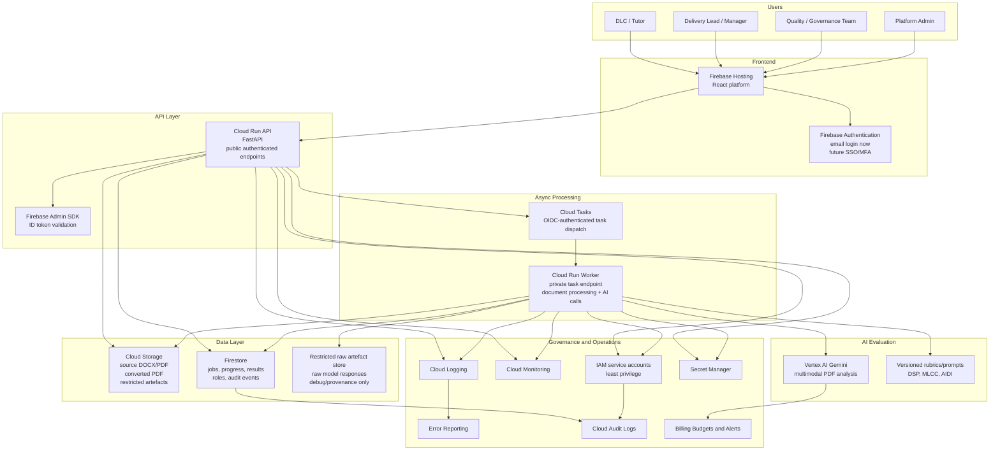

# KSB Marker Target GCP Architecture

**Status:** Target architecture, not current deployed state  
**Scope:** KSB Marker platform on Google Cloud Platform  
**Purpose:** Explain the intended production-grade architecture for secure, asynchronous KSB assessment processing.

---

## 1. Important status note

This document describes the **target platform architecture** for KSB Marker.

The current deployed prototype is closer to:



The target architecture moves the platform to:

- Firebase Authentication with backend token validation.
- Cloud Run API and separate Cloud Run Worker services.
- Cloud Tasks for asynchronous assessment processing.
- Cloud Storage for uploaded and converted documents.
- Firestore for assessment jobs, assessment records, progress, results, and audit events.
- Vertex AI Gemini for enterprise-governed multimodal model calls.
- Per-KSB checkpointing so failed retries do not rerun the whole assessment.
- Processing leases and heartbeats so jobs do not get stuck.
- Dynamic progress messaging rather than fixed completion-time promises.
- Separated audit metadata and raw model/provenance artefacts.

---

## 2. Target sequence diagram



---

## 3. Target platform services



---

## 4. Key design decisions

### 4.1 Asynchronous assessment processing

The frontend must not wait for the full KSB marking process inside one long HTTP request.

Instead:

1. The API creates an assessment job.
2. The file is uploaded to Cloud Storage.
3. The job is stored in Firestore as `queued`.
4. Cloud Tasks invokes the worker.
5. The frontend polls job status until completion.

This directly reduces the risk of browser-side `Failed to fetch` errors.

---

### 4.2 Per-KSB checkpointing

Each KSB result should be written to Firestore as soon as it is completed.

This prevents a retry from repeating all model calls if a later KSB fails.

Recommended structure:

```text
assessment_jobs/{job_id}/ksb_results/{ksb_code}
```

Each checkpoint should include:

- `ksb_code`
- `grade`
- `confidence`
- `pass_criteria_met`
- `merit_criteria_met`
- `evidence`
- `strengths`
- `improvements`
- `rationale`
- `borderline_flag`
- `borderline_reason`
- `model_name`
- `prompt_version`
- `rubric_version`
- `completed_at`

The job document should track:

- `total_ksbs`
- `completed_ksbs`
- `failed_ksbs`
- `progress_percent`
- `current_stage`

---

### 4.3 Processing leases and heartbeats

A worker may crash after claiming a job. To avoid jobs becoming stuck forever in `processing`, each processing claim should use a lease.

Recommended fields:

```text
status: queued | processing | completed | failed | cancelled
attempt_count: number
processing_started_at: timestamp
lease_until: timestamp
last_heartbeat_at: timestamp
worker_id: string
terminal_outcome: completed | failed | cancelled | null
```

A worker can claim a job if:

```text
status == queued
OR
status == processing AND lease_until < now()
```

The worker should periodically update:

```text
last_heartbeat_at = now()
lease_until = now() + lease_duration
```

---

### 4.4 Dynamic user-facing progress messaging

Do not hardcode a fixed estimate such as `4-6 minutes`.

Preferred messages:

```text
Assessment queued. You can close this tab and return later.
```

```text
Processing report. Progress: 8 of 19 KSBs completed.
```

```text
Finalising referencing and overall evaluation.
```

If an estimate is shown, it should be calculated from:

- module selected
- number of KSBs
- file size
- historical average duration
- current retry state

---

### 4.5 Separation of audit metadata and raw model outputs

Audit events should remain lightweight and governance-focused.

Recommended audit event fields:

```text
audit_events/{event_id}
- actor_uid
- actor_email
- action
- assessment_id
- job_id
- timestamp
- api_version
- worker_version
- model_name
- prompt_version
- rubric_version
- outcome
- error_summary
```

Raw model responses should not be casually embedded inside audit metadata because they may include learner evidence or sensitive report content.

If raw model outputs are retained, store them separately with tighter access controls and retention rules:

```text
assessment_raw_outputs/{assessment_id}/ksb/{ksb_code}
```

or:

```text
gs://restricted-ksb-marker-provenance/{assessment_id}/raw_outputs.json
```

Access should be restricted to admin/debug roles only.

---

## 5. Recommended API endpoints

### Public authenticated API

```text
POST /assessment-jobs
GET  /assessment-jobs/{job_id}
GET  /assessments/{assessment_id}
POST /feedback
GET  /modules
GET  /health
```

### Worker-only API

```text
POST /process-assessment-job
```

The worker endpoint should only accept requests from Cloud Tasks using an OIDC token from the approved service account.

---

## 6. Firestore collections

Recommended initial Firestore layout:

```text
users/{uid}
roles/{uid}
learners/{learner_id}
assessment_jobs/{job_id}
assessment_jobs/{job_id}/ksb_results/{ksb_code}
assessments/{assessment_id}
audit_events/{event_id}
module_rubrics/{module_code}
assessment_raw_outputs/{assessment_id}/...
```

---

## 7. Why this architecture matters

This architecture makes KSB Marker suitable for an internal QA platform because it provides:

- safer authentication and role validation;
- better resilience for long-running document processing;
- reduced risk of frontend timeouts;
- recovery from duplicate task delivery or worker crashes;
- auditability for quality and governance teams;
- controlled use of Vertex AI through GCP IAM;
- clearer separation between user-facing results, operational logs, audit events, and raw debug/provenance artefacts.

---

## 8. Implementation sequence

Recommended order:

1. Add Firebase Admin token validation to the API.
2. Add Firestore `assessment_jobs` and `assessments` collections.
3. Add Cloud Storage upload for source documents.
4. Add `POST /assessment-jobs` and `GET /assessment-jobs/{id}`.
5. Add Cloud Tasks and the worker endpoint.
6. Move the current synchronous assessment logic into the worker.
7. Add per-KSB checkpointing.
8. Add processing leases and heartbeats.
9. Switch Gemini access from direct API key to Vertex AI with a Cloud Run service account.
10. Add audit events, provenance, and restricted raw-output storage.
11. Update frontend polling and assessment detail pages.
12. Add monitoring, budget alerts, and error reporting.
